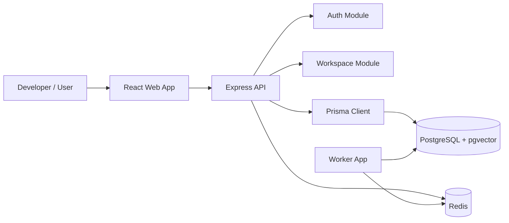
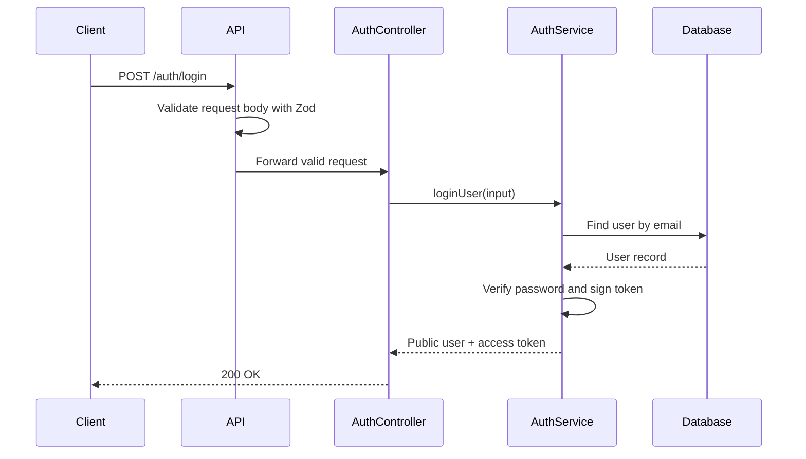

# ForgeLab 🚀

ForgeLab is an AI-powered project execution workspace for developers, founders, and technical mentors who want to turn rough software ideas into structured, research-backed, buildable products.

The long-term goal is simple: help a builder move from "I have an idea" to "I know what to build next" with clear product requirements, milestones, research notes, decisions, and project context in one place.

> Status: early foundation. The monorepo, local infrastructure, database schema, API authentication foundation, and initial workspace validation schemas are in place. Product features are still being built.

---

## Table of Contents 📚

- [What ForgeLab Does](#what-forgelab-does-)
- [Core Product Vision](#core-product-vision-)
- [Current Features](#current-features-)
- [Tech Stack](#tech-stack-)
- [Architecture Overview](#architecture-overview-)
- [Repository Structure](#repository-structure-)
- [Prerequisites](#prerequisites-)
- [Download The Project](#download-the-project-)
- [Installation](#installation-)
- [Environment Variables](#environment-variables-)
- [Database Setup](#database-setup-)
- [Start Development](#start-development-)
- [Useful Commands](#useful-commands-)
- [API Overview](#api-overview-)
- [Testing](#testing-)
- [Development Workflow](#development-workflow-)
- [GitHub Push Workflow](#github-push-workflow-)
- [Current Limitations](#current-limitations-)
- [Roadmap](#roadmap-)

---

## What ForgeLab Does ✨

ForgeLab is designed to become a focused workspace where a developer can:

- Capture a raw project idea.
- Turn that idea into a clearer product direction.
- Generate and edit a practical PRD.
- Break the product into milestones and tasks.
- Track blockers, decisions, and research findings.
- Upload project documents and ask questions about them later.
- Keep project execution grounded instead of scattered across notes, chats, and disconnected documents.

The product is especially useful for solo builders and early-stage teams who need structure but do not want heavyweight project management.

---

## Core Product Vision 🧭

Many software projects fail before implementation because the idea is vague, requirements are unclear, and important decisions are not written down. ForgeLab aims to solve that by becoming a practical execution layer between brainstorming and building.

ForgeLab should help answer questions like:

- What exactly are we building?
- Who is this for?
- What is the smallest useful version?
- What should be built first?
- What assumptions need research?
- What decisions have already been made?
- What context should the AI assistant remember about this project?

The goal is not to replace engineering judgment. The goal is to support it with better structure, memory, and workflow.

---

## Current Features ✅

The project currently includes:

- 🧱 Monorepo structure using `pnpm` workspaces.
- 🌐 React frontend scaffold powered by Vite.
- 🔌 Express API server.
- 🐘 PostgreSQL database through Docker Compose.
- 🧠 `pgvector`-ready PostgreSQL image for future RAG/document features.
- ⚡ Redis service through Docker Compose for future queues/cache/session workflows.
- 🔐 Authentication foundation:
  - user registration
  - login
  - access token generation
  - authenticated `/auth/me` endpoint
- 🧬 Prisma schema for:
  - users
  - workspaces
  - workspace members
  - projects
- 🧪 API test setup with Vitest and Supertest.
- 🧰 Shared validation and error-handling middleware.
- 🧾 Initial workspace validation schemas.
- 👷 Worker app scaffold for future background jobs.

---

## Tech Stack 🛠️

| Area | Technology |
| --- | --- |
| Monorepo | pnpm workspaces |
| Frontend | React, Vite, TypeScript |
| Backend | Node.js, Express, TypeScript |
| Database | PostgreSQL |
| Vector-ready DB image | `pgvector/pgvector:pg17` |
| ORM / database tooling | Prisma |
| Authentication | JWT-style access tokens with `jose`, password hashing with `argon2` |
| Validation | Zod |
| Testing | Vitest, Supertest |
| Local infrastructure | Docker Compose |
| Worker runtime | Node.js, TypeScript, `tsx` |

---

## Architecture Overview 🏗️



### What this diagram means

- `React Web App` is the browser-facing UI.
- `Express API` owns HTTP routes, validation, authentication, and server-side business logic.
- `Auth Module` currently handles registration, login, and authenticated user lookup.
- `Workspace Module` currently has validation schemas and is expected to grow into workspace routes/services.
- `Prisma Client` is the database access layer.
- `PostgreSQL + pgvector` stores relational data today and can support vector search later.
- `Redis` is available for future background jobs, caching, or queue workflows.
- `Worker App` is currently a scaffold and will likely own async/background processing later.

---

## Repository Structure 📁

```text
forgelab/
├── apps/
│   ├── api/                 # Express API, Prisma schema, backend modules
│   ├── web/                 # React + Vite frontend
│   └── worker/              # Background worker scaffold
├── packages/
│   └── shared/              # Shared package placeholder
├── docker-compose.yaml      # Local PostgreSQL and Redis infrastructure
├── pnpm-workspace.yaml      # pnpm workspace configuration
├── package.json             # Root scripts for dev and infrastructure
├── .env.example             # Example environment configuration
└── README.md                # Project documentation
```

Important backend folders:

```text
apps/api/src/
├── app.ts                   # Express app setup and route registration
├── server.ts                # API server startup and shutdown handling
├── config/                  # Environment loading and validation
├── modules/
│   ├── auth/                # Auth schemas, routes, controllers, services, tokens
│   └── workspaces/          # Workspace schemas and future workspace service/routes
├── shared/
│   ├── db/                  # Prisma client setup
│   ├── errors/              # AppError type
│   ├── middleware/          # Error handling and validation middleware
│   └── utils/               # Shared API utilities
└── types/                   # Express type extensions
```

---

## Prerequisites 📦

Install these before running the project:

- Node.js 24 LTS
- pnpm
- Docker
- Docker Compose
- Git

Check your versions:

```bash
node --version
pnpm --version
docker --version
docker compose version
git --version
```

---

## Download The Project ⬇️

Clone the repository:

```bash
git clone git@github.com:YOUR_USERNAME/forgelab.git
cd forgelab
```

If you use HTTPS instead of SSH:

```bash
git clone https://github.com/YOUR_USERNAME/forgelab.git
cd forgelab
```

If the repository is still local and has not been pushed to GitHub yet, create an empty GitHub repository first, then connect it using the workflow in [GitHub Push Workflow](#github-push-workflow-).

---

## Installation ⚙️

Install dependencies from the repository root:

```bash
pnpm install
```

Create your local environment file:

```bash
cp .env.example .env
```

Then review `.env` and change secrets before using the project for anything beyond local development.

---

## Environment Variables 🔐

The project expects a root `.env` file.

Current variables:

| Variable | Purpose |
| --- | --- |
| `POSTGRES_DB` | Local PostgreSQL database name |
| `POSTGRES_USER` | Local PostgreSQL user |
| `POSTGRES_PASSWORD` | Local PostgreSQL password |
| `POSTGRES_PORT` | Host port mapped to PostgreSQL |
| `REDIS_PORT` | Host port mapped to Redis |
| `API_PORT` | Port used by the Express API |
| `VITE_API_URL` | Frontend URL for the API |
| `DATABASE_URL` | PostgreSQL connection string used by Prisma |
| `AUTH_ACCESS_TOKEN_SECRET` | Secret used to sign access tokens |
| `AUTH_ACCESS_TOKEN_EXPIRES_IN` | Access token lifetime |
| `AUTH_TOKEN_ISSUER` | Expected token issuer |
| `AUTH_TOKEN_AUDIENCE` | Expected token audience |

For local development, `.env.example` provides working defaults. For production, the token secret must be long, private, and generated securely.

---

## Database Setup 🐘

Start local infrastructure:

```bash
pnpm infra:up
```

Check running containers:

```bash
pnpm infra:ps
```

Run Prisma migrations:

```bash
pnpm --filter @forgelab/api db:migrate
```

Optional: seed the database if seed data exists:

```bash
pnpm --filter @forgelab/api db:seed
```

Optional: open Prisma Studio:

```bash
pnpm --filter @forgelab/api db:studio
```

Stop local infrastructure:

```bash
pnpm infra:down
```

---

## Start Development ▶️

Start the full development stack:

```bash
pnpm dev
```

This runs:

- `@forgelab/web`
- `@forgelab/api`
- `@forgelab/worker`

You can also start each app separately.

Start only the frontend:

```bash
pnpm dev:web
```

Start only the API:

```bash
pnpm dev:api
```

Start only the worker:

```bash
pnpm dev:worker
```

Default local URLs:

| Service | URL |
| --- | --- |
| Web app | `http://localhost:5173` |
| API | `http://localhost:4000` |
| API health check | `http://localhost:4000/health` |
| Database health check | `http://localhost:4000/db-health` |

The API port comes from `API_PORT` in `.env`.

---

## Useful Commands 🧰

Root commands:

```bash
pnpm dev
pnpm dev:web
pnpm dev:api
pnpm dev:worker
pnpm infra:up
pnpm infra:down
pnpm infra:logs
pnpm infra:ps
```

API commands:

```bash
pnpm --filter @forgelab/api build
pnpm --filter @forgelab/api test
pnpm --filter @forgelab/api db:format
pnpm --filter @forgelab/api db:validate
pnpm --filter @forgelab/api db:migrate
pnpm --filter @forgelab/api db:seed
pnpm --filter @forgelab/api db:studio
```

Web commands:

```bash
pnpm --filter @forgelab/web build
pnpm --filter @forgelab/web lint
pnpm --filter @forgelab/web preview
```

Worker commands:

```bash
pnpm --filter @forgelab/worker build
pnpm --filter @forgelab/worker start
```

---

## API Overview 🔌

Current API routes:

| Method | Route | Purpose |
| --- | --- | --- |
| `GET` | `/health` | Confirms the API process is running |
| `GET` | `/db-health` | Confirms the API can reach PostgreSQL |
| `POST` | `/auth/register` | Registers a new user |
| `POST` | `/auth/login` | Logs in an existing user |
| `GET` | `/auth/me` | Returns the authenticated user |

The API follows this rough module pattern:

```text
schema -> validation middleware -> route -> controller -> service -> database
```

Example auth flow:



---

## Testing 🧪

Run API tests:

```bash
pnpm --filter @forgelab/api test
```

Current tests cover the authentication route flow:

- register user
- reject duplicate registration
- login with valid credentials
- reject invalid credentials
- reject `/auth/me` without a token
- return the authenticated user with a valid token

Before running integration-style API tests, make sure PostgreSQL is running and migrations have been applied:

```bash
pnpm infra:up
pnpm --filter @forgelab/api db:migrate
pnpm --filter @forgelab/api test
```

---

## Development Workflow 🧑‍💻

Recommended local workflow:

1. Pull the latest changes.
2. Install dependencies if `pnpm-lock.yaml` changed.
3. Start infrastructure with `pnpm infra:up`.
4. Run migrations with `pnpm --filter @forgelab/api db:migrate`.
5. Start development with `pnpm dev`.
6. Make a small focused change.
7. Run the relevant build or test command.
8. Commit with a clear message.

Good commit message examples:

```text
feat(api): add workspace creation service
fix(api): handle duplicate workspace slugs
test(api): cover auth login failure cases
docs: expand local development setup
chore: update workspace dependencies
```

Keep commits focused. A good commit should be easy to review and easy to revert if needed.

---

## GitHub Push Workflow 🌍

If this project is not connected to GitHub yet, create an empty repository on GitHub first. Do not initialize it with a README if this local repo already has one.

Then connect your local repository:

```bash
git remote add origin git@github.com:YOUR_USERNAME/forgelab.git
git branch -M main
git push -u origin main
```

If you use HTTPS:

```bash
git remote add origin https://github.com/YOUR_USERNAME/forgelab.git
git branch -M main
git push -u origin main
```

For future pushes:

```bash
git push
```

Check repository status:

```bash
git status
```

Check configured remotes:

```bash
git remote -v
```

---

## Current Limitations ⚠️

ForgeLab is still early. Important limitations:

- The frontend is still a basic Vite/React scaffold.
- The worker currently starts but does not process real jobs yet.
- Workspace routes and services are not complete yet.
- Project creation and project management APIs are not implemented yet.
- PRD generation, research workflows, document upload, and RAG Q&A are planned but not implemented.
- Redis is available locally but not deeply integrated yet.
- Production deployment configuration is not defined yet.

These limitations are normal for the current stage, but they should be documented clearly so contributors understand what exists versus what is planned.

---

## Roadmap 🗺️

Near-term engineering roadmap:

- Complete workspace module:
  - create workspace
  - list user workspaces
  - get workspace by ID
  - update workspace name
  - membership checks
- Add project module:
  - create project from raw idea
  - list projects in a workspace
  - update project metadata
- Connect frontend to API auth flows.
- Add authenticated app layout.
- Add workspace/project dashboard views.
- Add stronger test coverage for workspace and project modules.
- Introduce background jobs once async AI/document workflows exist.

Longer-term product roadmap:

- AI-generated editable PRDs.
- AI-generated milestone plans.
- Research notes and decision logs.
- Document upload.
- RAG-powered Q&A over project materials.
- Dashboard views for blockers, milestones, and recent decisions.

---

## Engineering Principles 🧠

ForgeLab should stay:

- Correct before clever.
- Simple before abstract.
- Modular without being overengineered.
- Easy to run locally.
- Easy to test.
- Honest about what is implemented.
- Friendly to future contributors.

The codebase should grow through small, understandable modules rather than large rewrites.
